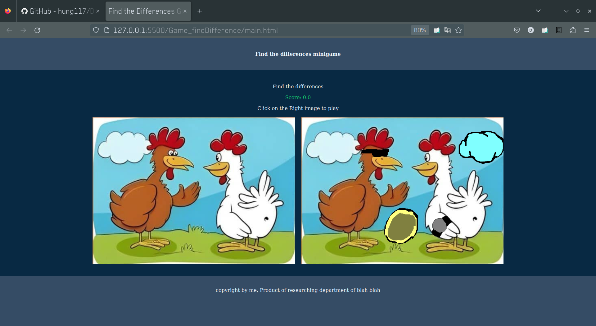

# DetectDifferences
Assignment
# The Game
The game is accessible via "Game_findDifference" folder, open the webpage with "main.html"  
Please play in the 100% viewport, the game currently has scaling problem.  

- The game initially looks like this 

- After the player click on the different zone, score would be updated and a circle is drawn in that place.  

- Finding all different zones will lead player to victory ! 

